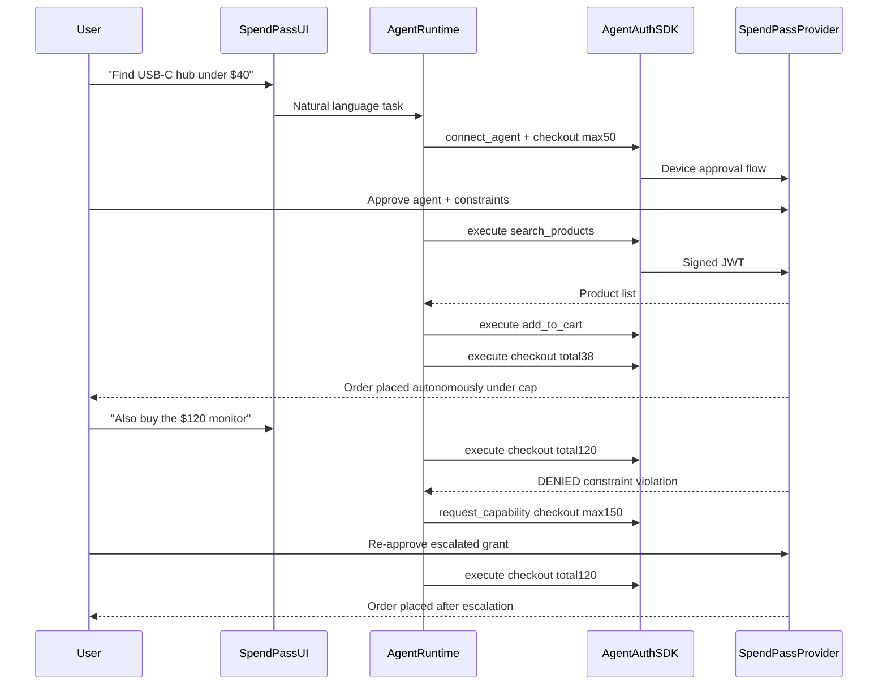

# SpendPass — Build Target

**Status:** Confirmed  
**Date:** 2026-06-05  
**Project:** SpendPass — scoped spending delegation for AI commerce agents  
**Repository:** `veriagent` (umbrella brand; SpendPass is the demo app)

---

## Problem

People want AI agents to shop, renew subscriptions, and compare prices—but giving an agent a credit card or stored payment method is all-or-nothing. Terminal 3 explicitly calls out that *transaction AI agents pose a risk of executing unauthorized transactions.* There is no standard way to say: *"You may spend up to $50 at these merchants, and anything else requires my explicit approval."*

SpendPass answers that gap using the Agent Auth protocol: cryptographic agent identity, scoped capabilities, constraint enforcement, escalation, revocation, and a full audit trail.

---

## What we are building

A hackathon MVP that proves an AI commerce agent **cannot** spend without grants, **must** re-approve when escalating, and leaves a verifiable record of every action.

| Layer | Responsibility |
|-------|----------------|
| **SpendPass Provider** | `@better-auth/agent-auth` server — registers agents, issues grants, enforces constraints, logs executions |
| **Agent client** | `@auth/agent` + Vercel AI SDK — parses user intent, calls capabilities only via signed JWTs |
| **Mock store** | SQLite/Drizzle catalog (~20 products), cart, and checkout — no real payment processor |
| **Delegation dashboard** | Live view of agent ID, granted capabilities, constraint JSON, audit log, revoke control |

---

## Core workflow

---

## Why Agent Auth SDK is essential

SpendPass **is** Agent Auth applied to payments. Without `@auth/agent` and `@better-auth/agent-auth`:

- No cryptographic agent identity (`agt_*`) tied to each action
- No capability constraints (e.g. `{ checkout: { max_amount: 50, merchants: ["amazon-mock"] } }`)
- No escalation flow when the agent exceeds its grant
- No audit trail proving *which agent* executed *which capability* under *which constraint*

A chatbot with a Stripe API key cannot demonstrate delegated, revocable, constrained authorization—the core Terminal 3 thesis.

---

## MVP feature checklist

### Provider capabilities

| Capability | Behavior |
|------------|----------|
| `search_products` | Query mock catalog by keyword, category, max price |
| `add_to_cart` | Add item to session cart |
| `get_cart` | Return current cart + running total |
| `checkout` | Place order; enforce `max_amount` and merchant allowlist; device or WebAuthn approval |

### Constraint enforcement

- Reject `checkout` when `total > grant.max_amount`
- Reject `checkout` when merchant not in grant allowlist
- Return clear denial reason so the agent can trigger escalation

### Agent client

- Natural-language interface (chat UI or CLI)
- All store actions routed through `@auth/agent` — never direct API calls
- On denial: call `request_capability` with escalated constraints

### Delegation dashboard

- Active agent ID (`agt_*`)
- Granted capabilities and constraint JSON
- Live audit log: capability name, args hash, timestamp, agent ID, result (success / denied)
- **Revoke** button: `disconnect_agent` blocks further executions instantly

### Mock catalog

- ~20 products across a few categories (hubs, monitors, cables, etc.)
- Seeded in SQLite via Drizzle
- Prices chosen to support the demo arc ($38 hub, $120 monitor)

---

## Build phases

### Phase 1 — Foundation (Day 1)

**Goal:** Runnable provider + agent client with basic catalog and one working capability.

| Task | Deliverable |
|------|-------------|
| Fork `agent-deploy` from [better-auth/agent-auth](https://github.com/better-auth/agent-auth) | Next.js app with auth, Drizzle, SQLite wired |
| Replace deploy domain with commerce domain | Product schema, seed script, cart tables |
| Register SpendPass capabilities | `search_products`, `add_to_cart`, `get_cart`, `checkout` defined on provider |
| Implement `search_products` + `get_cart` | Agent can search catalog and read cart via SDK |
| Wire `@auth/agent` client | `connect_agent` + `execute` for search; device approval flow works end-to-end |
| Basic chat/agent UI shell | User can type a request; agent calls capabilities (even if checkout not done yet) |

**Exit criteria:** User approves an agent, agent searches products, results appear in UI.

---

### Phase 2 — Constraints and checkout (Day 1–2)

**Goal:** Full purchase flow with constraint enforcement and denial path.

| Task | Deliverable |
|------|-------------|
| Implement `add_to_cart` + `checkout` | Agent can complete a purchase under cap |
| Enforce checkout constraints | Deny when over `max_amount` or wrong merchant |
| Grant constraints on connect | User approves with `$50 cap` + merchant allowlist |
| Escalation flow | Agent calls `request_capability` on denial; user re-approves higher cap |
| Audit log (server-side) | Every `execute` writes capability, agent ID, args hash, timestamp, outcome |
| Test denial path | $120 checkout against $50 grant returns denial + triggers escalation |

**Exit criteria:** Under-cap purchase succeeds; over-cap purchase fails then succeeds after re-approval.

---

### Phase 3 — Dashboard and revocation (Day 2)

**Goal:** Delegation visibility and instant revoke for the demo narrative.

| Task | Deliverable |
|------|-------------|
| Delegation dashboard page | Agent status, capability list, constraint JSON |
| Live audit log UI | Chronological feed of agent actions |
| Revoke control | `disconnect_agent` button; verify next checkout fails |
| Demo script hardening | Rehearse: connect → buy $38 → deny $120 → escalate → revoke |
| Error/denial UX | Red toast or inline message: "Exceeds $50 grant" |

**Exit criteria:** Full demo arc runs reliably without manual DB edits.

---

### Phase 4 — Polish and submission (Day 3)

**Goal:** Judge-ready repo, video, and documentation.

| Task | Deliverable |
|------|-------------|
| UI polish | Clean storefront + dashboard; readable on video |
| README finalization | Setup instructions, architecture diagram, Agent Auth lifecycle explanation |
| Optional: `@auth/agent-cli mcp` | Cursor demo path if time allows |
| Record 90s demo video | Follow storyboard below |
| Submission package | Public repo, video link, DoraHacks entry |

**Exit criteria:** Submission checklist complete; demo video shows full lifecycle.

---

## Demo storyboard (90 seconds)

1. Open SpendPass dashboard — empty audit log, no active agent.
2. User: *"Find a USB-C hub under $40 and buy it."*
3. Browser opens **device approval** — user grants `checkout` with **$50 cap**, sees agent identity `agt_…`.
4. Agent searches → adds to cart → checkout **$38 succeeds** — audit log fills with signed actions.
5. User: *"Buy the $120 monitor too."*
6. Agent attempts checkout → **blocked by constraint** ("Exceeds $50 grant").
7. Agent triggers **capability escalation** → user re-approves **$150 cap**.
8. Checkout succeeds. User hits **Revoke Agent** → next purchase fails instantly.
9. End card: *"Same agent. Cryptographic identity. Scoped spend. Full audit."*

---

## What judges score on

| Criterion | How SpendPass demonstrates it |
|-----------|-------------------------------|
| Problem significance | Real delegation risk for transaction agents |
| Agent Auth depth | Registration, constraints, escalation, revocation, audit — not a single `execute` call |
| Demo clarity | Video proves agent cannot act without grants and must re-approve on escalation |
| Build feasibility | Forked reference code; mock store; no external payment APIs |

---

## Technical stack

| Component | Choice |
|-----------|--------|
| Provider | Next.js + `@better-auth/agent-auth` |
| Database | SQLite + Drizzle (same pattern as agent-auth examples) |
| Agent client | `@auth/agent` + Vercel AI SDK adapter |
| Optional demo | `@auth/agent-cli mcp` for Cursor |
| Payments | None — mock checkout only |

**Deadline:** June 7, 2026 — [T3 Agent Dev Kit Bounty](https://dorahacks.io/hackathon/t3adkdevchallengebeta/qa)

---

## Submission checklist

- [ ] Public GitHub repo with setup instructions
- [ ] Demo video: connect → approve → constrained execute → denial → escalation → revoke
- [ ] README explaining why Agent Auth SDK is essential (not an optional OAuth wrapper)
- [ ] Architecture diagram showing Agent Auth lifecycle
