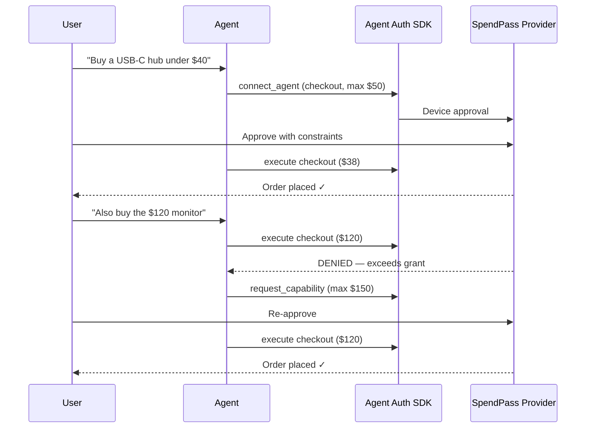

# VeriAgent — SpendPass

**Scoped spending delegation for AI commerce agents.**

SpendPass lets you delegate shopping to an AI agent with explicit spending limits—not a stored credit card or all-or-nothing API key. The agent gets a cryptographic identity (`agt_*`), scoped capabilities, and every purchase is logged, constrained, and revocable.

Built for the [Terminal 3 Agent Dev Kit Bounty](https://dorahacks.io/hackathon/t3adkdevchallengebeta/qa) (deadline **June 7, 2026**).

---

## The problem

> *"You may spend up to $50 at these merchants. Anything else requires my explicit approval."*

Today, giving an agent payment access is binary: full card access or nothing. Terminal 3 calls out that transaction agents risk **executing unauthorized purchases**. SpendPass uses the [Agent Auth SDK](https://github.com/better-auth/agent-auth) to make delegation scoped, auditable, and revocable.

---

## How it works



**Agent Auth is not optional plumbing** — it provides agent identity, capability constraints, escalation, revocation, and audit. A chatbot with a Stripe key cannot demonstrate any of that.

---

## Architecture

```
┌─────────────────────────────────────────────────────────────┐
│  User                                                        │
│    ├── Chat UI (natural language requests)                   │
│    └── Delegation Dashboard (grants, audit log, revoke)      │
└──────────────────────────┬──────────────────────────────────┘
                           │
┌──────────────────────────▼──────────────────────────────────┐
│  Agent Client (@auth/agent + Vercel AI SDK)                  │
│    connect_agent · execute · request_capability              │
└──────────────────────────┬──────────────────────────────────┘
                           │ signed JWTs
┌──────────────────────────▼──────────────────────────────────┐
│  SpendPass Provider (@better-auth/agent-auth)                 │
│    Capabilities: search_products · add_to_cart · get_cart     │
│                  checkout (constraint enforcement)             │
│    SQLite/Drizzle: products · cart · orders · audit log       │
└─────────────────────────────────────────────────────────────┘
```

---

## MVP features

| Feature | Description |
|---------|-------------|
| Mock catalog | ~20 products in SQLite; no real payment processor |
| Scoped checkout | Enforce `max_amount` and merchant allowlist on every purchase |
| Device approval | User grants capabilities with constraints at connect time |
| Escalation | Over-cap purchase denied → agent requests higher grant → user re-approves |
| Audit log | Every capability execution logged with agent ID, args hash, outcome |
| Revoke | `disconnect_agent` instantly blocks all further agent actions |

### Capabilities

| Capability | Notes |
|------------|-------|
| `search_products` | Keyword, category, max-price filters |
| `add_to_cart` | Session-scoped cart |
| `get_cart` | Items + running total |
| `checkout` | Constraint enforcement; device or WebAuthn approval |

---

## Build phases

Full phase breakdown lives in [BUILD_TARGET.md](./BUILD_TARGET.md). Summary:

| Phase | Focus | Exit criteria |
|-------|-------|---------------|
| **1 — Foundation** | Fork `agent-deploy`; mock catalog; wire `@auth/agent`; `search_products` works | User approves agent, agent searches catalog |
| **2 — Constraints & checkout** | `add_to_cart`, `checkout`, denial + escalation, server audit log | $38 purchase succeeds; $120 denied then succeeds after re-approval |
| **3 — Dashboard & revoke** | Delegation UI, live audit log, revoke button, demo rehearsal | Full demo arc runs end-to-end |
| **4 — Polish & submit** | UI polish, README, architecture diagram, 90s demo video | Submission checklist complete |

---

## Demo arc (submission video)

1. Empty dashboard — no agent, no audit entries
2. User delegates with **$50 checkout cap** → sees `agt_…` identity
3. Agent buys **$38 USB-C hub** autonomously → audit log updates
4. User asks for **$120 monitor** → checkout **denied**
5. Escalation → user re-approves **$150 cap** → purchase succeeds
6. User **revokes agent** → next action fails instantly

---

## Tech stack

- **Provider:** Next.js, `@better-auth/agent-auth`, SQLite, Drizzle
- **Agent client:** `@auth/agent`, Vercel AI SDK
- **Optional:** `@auth/agent-cli mcp` for Cursor demos
- **Reference:** [better-auth/agent-auth examples](https://github.com/better-auth/agent-auth) (`agent-deploy` fork)

---

## Quick start

### 1. Configure environment

Copy `.env.example` to `.env` and fill in:

| Variable | Required | Description |
|----------|----------|-------------|
| `DATABASE_URL` | Yes | PostgreSQL connection string |
| `BETTER_AUTH_SECRET` | Yes | `openssl rand -base64 32` |
| `BETTER_AUTH_URL` | Yes | `http://localhost:3100` |
| `NEXT_PUBLIC_APP_URL` | Yes | Same as `BETTER_AUTH_URL` for local dev |
| `OPENAI_API_KEY` | Yes | Powers the shopping agent chat |
| `AGENT_AUTH_ENCRYPTION_KEY` | No | Encrypts agent keys in `.agent-data/` |

### 2. Database setup

```bash
npm install
npm run db:push
npm run db:seed
```

### 3. Run

```bash
npm run dev
```

Open [http://localhost:3100](http://localhost:3100) → create an account → **Agent** tab to chat with the shopping agent.

### Phase 1 flow

1. Ask: *"Find a USB-C hub under $40"*
2. Agent calls `connect_agent` → browser opens device approval
3. Approve capabilities → agent searches catalog via `search_products`

## Status

**Phase 1 in progress** — provider, catalog, agent chat wired. Checkout constraints ship in Phase 2. See [BUILD_TARGET.md](./BUILD_TARGET.md) for the full spec.

---

## Submission checklist

- [ ] Public GitHub repo with setup instructions
- [ ] Demo video: connect → approve → execute → denial → escalation → revoke
- [ ] README with architecture diagram and Agent Auth lifecycle explanation
