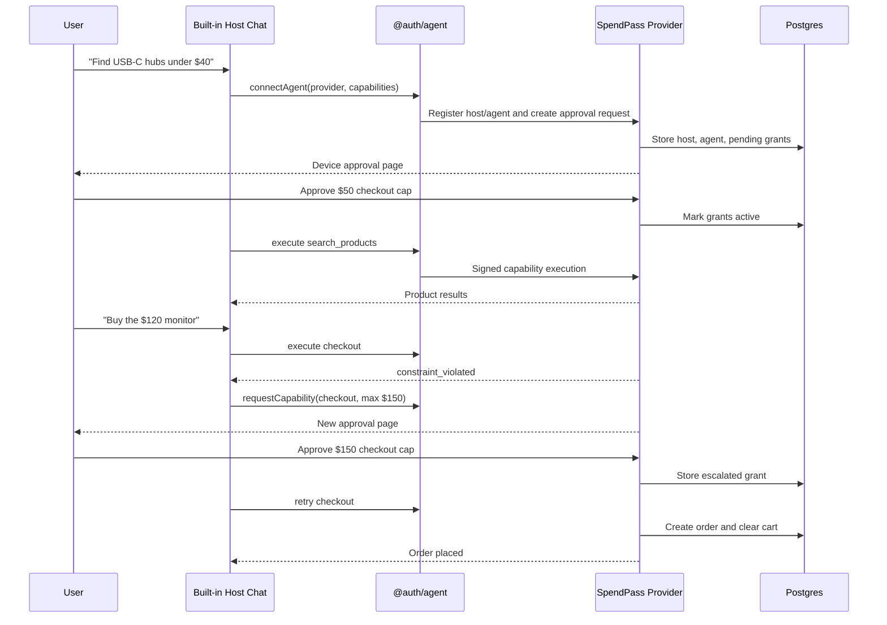

# SpendPass

SpendPass is a scoped spending delegation demo for AI commerce agents, built with the Terminal 3 Agent Auth SDK.

Instead of giving an AI agent a credit card or unrestricted checkout access, SpendPass lets a user approve exactly what the agent may do:

> *"You may search this store, manage my cart, and checkout — up to $50 at spendpass-store. Anything above that requires a new approval."*

That constraint is enforced server-side through Agent Auth capabilities and grants. The chat interface is just the host — the trust boundary lives in the protocol.

**Routes**
- `/dashboard/chat` — Chat interface with built-in shopping agent
- `/device/capabilities` — Agent approval page
- `/dashboard/delegation` — View active grants and agent sessions
- `/api/auth/[[...all]]` — Better Auth + Agent Auth provider routes

**Stack**
- Next.js 16 · Better Auth · Agent Auth SDK · Drizzle ORM · Postgres · Gemini AI

## Architecture

SpendPass contains both sides of the Agent Auth flow in one Next.js application.

### Provider

The provider is SpendPass itself. It owns the catalog, cart, checkout, users, grants, and approval decisions.

Provider implementation:

- `lib/auth.ts`
- `app/api/auth/[[...all]]/route.ts`
- `app/device/capabilities/page.tsx`

The provider exposes four capabilities:

| Capability | Purpose | Constraint behavior |
| --- | --- | --- |
| `search_products` | Search the mock catalog | No checkout authority |
| `add_to_cart` | Add a product to the current agent cart | Requires approved agent capability |
| `get_cart` | Read the current cart and total | Requires approved agent capability |
| `checkout` | Place an order from the cart | Enforces `max_amount` and `merchants` constraints |

### Host

The host is the built-in shopping agent used by the chat page. It is the side that asks the provider for permission and then executes capabilities.

Host implementation:

- `app/api/chat/route.ts`
- `lib/agent/storage.ts`
- `lib/agent/client.ts`

The host uses `@auth/agent` to:

- register/connect a host identity
- request user approval
- persist host identity and agent connection data in Postgres
- execute approved provider capabilities
- request higher checkout limits when the current grant is too small

External judges do not need to bring their own host. They can use the built-in host from `/dashboard/chat`.

## Agent Auth Lifecycle



## Runtime Flow

### 1. User signs in

The judge creates an account through Better Auth email/password auth.

Routes:

- `/sign-up`
- `/sign-in`

### 2. User opens the chat host

The user opens:

```text
/dashboard/chat
```

On the first shopping request, the API route creates an `AgentAuthClient`, initializes it, and connects an agent to the SpendPass provider URL.

### 3. User approves capabilities

The approval page asks the user to approve capabilities such as:

```text
search_products
add_to_cart
get_cart
checkout with max_amount <= 50 and merchants in ["spendpass-store"]
```

The approval creates active capability grants in Postgres.

### 4. Agent executes capabilities

After approval, the host can call provider capabilities. It cannot bypass `lib/auth.ts`; all store operations go through Agent Auth execution.

### 5. Checkout constraints are enforced

When checkout runs, the provider checks:

- the cart is not empty
- all items are from one merchant
- the agent has an active `checkout` grant
- the cart total is within `max_amount`
- the merchant is included in the `merchants` allowlist

If a constraint fails, checkout does not create an order.

### 6. Escalation requires new approval

If the cart is above the current cap, the host requests a higher checkout grant. The current implementation waits for the specific escalated checkout grant to become active before retrying checkout.

### 7. Revocation blocks old delegation

The delegation dashboard can revoke an active agent. After revocation, the old agent connection cannot continue executing capabilities; a fresh approval is required.

## Tech Stack

- Next.js 16
- React 19
- Better Auth
- `@better-auth/agent-auth`
- `@auth/agent`
- Drizzle ORM
- Postgres via `postgres-js`
- Tailwind CSS

Database note: this project uses Drizzle ORM, not Prisma ORM. It can still use any normal Postgres connection string, including Supabase, Neon, local Postgres, or Prisma Postgres if the URL exposes a standard Postgres endpoint.

## Local Setup

### 1. Install dependencies

```bash
npm install
```

### 2. Configure environment

Copy `.env.example` to `.env` and set:

| Variable | Required | Description |
| --- | --- | --- |
| `DATABASE_URL` | Yes | Postgres connection string |
| `BETTER_AUTH_SECRET` | Yes | Better Auth secret, for example `openssl rand -base64 32` |
| `BETTER_AUTH_URL` | Yes | Local app URL, usually `http://localhost:3100` |
| `NEXT_PUBLIC_APP_URL` | Yes | Same origin as the app |
| `AGENT_AUTH_ENCRYPTION_KEY` | No | Optional key for agent private key encryption |

For local development:

```env
BETTER_AUTH_URL=http://localhost:3100
NEXT_PUBLIC_APP_URL=http://localhost:3100
```

For a public deployment, both URL values must be changed to the deployed origin.

### 3. Push schema and seed products

```bash
npm run db:push
npm run db:seed
```

### 4. Verify setup

```bash
npm run verify
```

Expected result:

- database connects successfully
- required environment variables are present
- product catalog contains seeded products

### 5. Run locally

```bash
npm run dev
```

Open:

```text
http://localhost:3100
```

## Judge Test Script

Use this flow to verify the complete Agent Auth lifecycle.

### 1. Create an account

Open:

```text
http://localhost:3100/sign-up
```

Create any test user.

### 2. Browse catalog

Open:

```text
http://localhost:3100/dashboard
```

Confirm products appear.

### 3. Connect the agent

Open:

```text
http://localhost:3100/dashboard/chat
```

Send:

```text
Find USB-C hubs under $40
```

Approve the requested capabilities in the approval window.

Expected:

- chat shows an agent connection
- product results are returned
- `/dashboard/delegation` shows an active agent and grants

### 4. Checkout under the cap

Send:

```text
Add the USB-C Hub 7-in-1 to my cart
```

Then:

```text
Checkout
```

Expected:

- order is placed
- checkout is within the initial `$50` cap
- cart is cleared after successful checkout

### 5. Test over-cap escalation

Send:

```text
Buy the $120 monitor too
```

Expected:

- initial checkout attempt is blocked by the `$50` grant
- chat requests a higher `$150` checkout approval
- a new approval page opens
- after approval, checkout retries and succeeds

### 6. Revoke

Open:

```text
http://localhost:3100/dashboard/delegation
```

Revoke the active agent.

Expected:

- old agent is no longer active
- another shopping request requires a fresh approval

## Deployment Checklist

For judges to test the live app, configure the deployed environment:

- `DATABASE_URL` points to a reachable Postgres database
- `BETTER_AUTH_SECRET` is set
- `BETTER_AUTH_URL` is the deployed app origin
- `NEXT_PUBLIC_APP_URL` is the deployed app origin
- database schema has been pushed with `npm run db:push`, including the `agent_client_kv` host storage table
- products have been seeded with `npm run db:seed`
- popup windows are allowed for the deployed origin during approval testing

Example deployed URL configuration:

```env
BETTER_AUTH_URL=https://your-app.example.com
NEXT_PUBLIC_APP_URL=https://your-app.example.com
```

Do not leave these as `localhost` in production.

## Useful Routes

| Route | Purpose |
| --- | --- |
| `/` | Entry page |
| `/dashboard` | Product catalog |
| `/dashboard/chat` | Built-in Agent Auth host/chat |
| `/dashboard/agents` | Agent list |
| `/dashboard/hosts` | Host list |
| `/dashboard/delegation` | Active grants, audit data, revocation |
| `/device/capabilities` | User approval page |
| `/api/chat` | Host-side shopping API |
| `/api/auth/[[...all]]` | Better Auth and Agent Auth provider API |

## Troubleshooting

### No products appear

Run:

```bash
npm run db:seed
```

Then verify:

```bash
npm run verify
```

### Approval page does not open

Allow popups for the app origin. The chat page opens the approval flow in a browser window.

### Deployed approval redirects to localhost

Update:

```env
BETTER_AUTH_URL=https://your-deployed-origin
NEXT_PUBLIC_APP_URL=https://your-deployed-origin
```

Restart or redeploy the app after changing environment variables.

### Checkout fails with a constraint error

That is expected for over-cap purchases. Approve the escalated checkout grant, then the host retries checkout.

### Database question: is this Prisma?

The app uses Postgres but not Prisma ORM. The ORM is Drizzle. A Prisma Postgres database can work if its `DATABASE_URL` is a normal Postgres connection string.

## Verification Commands

```bash
npx tsc --noEmit
npm run lint
npm run build
npm run verify
```

Current local verification has passed with a connected Postgres database and 20 seeded products.

## Repository Notes

The `_ref-agent-auth/` directory is a local reference copy of Agent Auth examples and is ignored by the app lint configuration. The SpendPass implementation lives in the root `app/`, `lib/`, `components/`, and `scripts/` directories.
